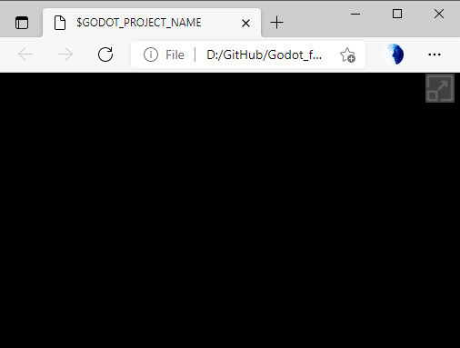

# Godot Engine Custom HTML Shell with fullscreen button

A custom html shell for Godot Web-based platforms (HTML5) with a fullscreen button.

Put the file path godot_FullScreen.html on the export screen in the "Custom HTML Shell".
After export copy the file full_button.png to the exported folder, you can change the button image, just replacing it with another file with the same name.

    
  </a>

    
  </a>

    
  </a>

